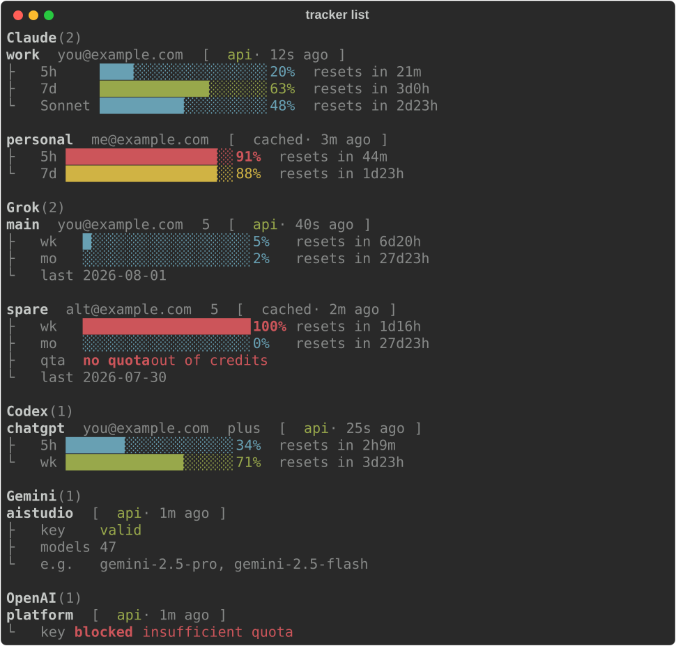

# tracker

**Unified local usage tracker for Claude, Grok, Codex, Gemini, and OpenAI.**

See every subscription's quota in one terminal command — no more logging into
each account, checking usage, and logging out.

[](LICENSE)
[](https://www.python.org/downloads/)

---

## Why

If you juggle multiple AI accounts, checking "who still has quota?" is a
ritual. **tracker** imports credentials from official CLIs (or accepts pasted
API keys), then:

- `tracker` / `tracker list` — dashboard for **all** accounts at once
- Refresh-if-stale collection (cached when fresh, network when not)
- Honors usage-endpoint 429 backoff so you keep last-known bars
- Auto-detects API keys by prefix (`sk-ant-`, `xai-`, `AIza`, `sk-`)
- Optional Discord webhook that posts and **edits** one live message

Read-only observability for the CLI sessions you already use. Token refresh
for Claude/Grok/Codex writes rotated grants back to the provider CLI file so
you are not forced into a re-login loop.

## Screenshot



```
Claude  (2)
  work  you@example.com  [api · 12s ago]
  ├ 5h     ████░░░░░░░░░░░░░░░░  20%  resets in 21m
  ├ 7d     █████████████░░░░░░░  63%  resets in 3d0h
  └ Sonnet ██████████░░░░░░░░░░  48%  resets in 2d23h

  personal  me@example.com  [cached · 3m ago]
  ├ 5h     ██████████████████░░  91%  resets in 44m
  └ 7d     ██████████████████░░  88%  resets in 1d23h

Grok  (2)
  main  you@example.com  t5  [api · 40s ago]
  ├ wk     █░░░░░░░░░░░░░░░░░░░   5%  resets in 6d20h
  ├ mo     ░░░░░░░░░░░░░░░░░░░░   2%  resets in 27d23h
  └ last    2026-08-01

  spare  alt@example.com  t5  [cached · 2m ago]
  ├ wk     ████████████████████ 100%  resets in 1d16h
  ├ mo     ░░░░░░░░░░░░░░░░░░░░   0%  resets in 27d23h
  ├ qta    no quota  out of credits
  └ last    2026-07-30
```

## Install

### From source (recommended while pre-release)

```bash
git clone https://github.com/sakethkanchi/tracker.git
cd tracker
uv tool install .          # installs the `tracker` CLI
# or:  pip install .
tracker --help
```

PyPI distribution name is **`ai-usage-tracker`** (the generic name `tracker` is
taken); the console command and import package remain `tracker`.

Editable install for development:

```bash
uv sync
uv run tracker list
# or
pip install -e .
```

### Requirements

- Python **3.11+**
- For subscription windows: the official provider CLI already logged in
  ([Claude Code](https://docs.anthropic.com/en/docs/claude-code),
  [Grok](https://grok.x.ai/),
  [Codex](https://github.com/openai/codex))
- For API-key accounts: a valid key from Anthropic / xAI / Google AI Studio /
  OpenAI platform

## Quick start

```bash
# 1. Import from a logged-in CLI
claude                 # or: grok login --oauth  /  codex (ChatGPT sign-in)
tracker add claude     # or: tracker add grok  /  tracker add codex

# 2. Or paste an API key — provider is auto-detected
tracker add sk-ant-api03-...     # Claude
tracker add xai-...              # Grok
tracker add AIza...              # Gemini
tracker add sk-proj-...          # OpenAI platform
# same thing via flag form:
tracker --add "AIzaSy..."

# 3. See everything
tracker                # same as: tracker list
tracker list --refresh # force network pass
tracker status         # one-line aggregate
```

## Commands

| Command | What it does |
|---------|----------------|
| `tracker` / `tracker list` | Primary dashboard — all accounts, refresh-if-stale |
| `tracker list --refresh` | Force-refresh every account, then show |
| `tracker add claude\|grok\|codex` | Import live OAuth credential from CLI config |
| `tracker add <api_key>` / `tracker --add <api_key>` | Auto-detect provider from key and add |
| `tracker sync` / `tracker sync --label NAME` | Force-refresh (all or one label) |
| `tracker tokens [--since 7d] [--provider …]` | Historical token report |
| `tracker status` | Compact aggregate line |
| `tracker remove LABEL` | Drop account + credential file |
| `tracker log PROVIDER LABEL --msgs N --resets-in 1h30m` | Manual usage sample |
| `tracker webhook` / `tracker webhook --once` | Discord channel dashboard |
| `tracker -V` | Version |

## Providers

| Provider | How to add | What you see |
|----------|------------|--------------|
| **Claude** | `tracker add claude` or `sk-ant-…` key | 5h / 7d / scoped / spend (OAuth); key health (API key) |
| **Grok** | `tracker add grok` or `xai-…` key | Weekly + monthly credits (OAuth); key health (API key) |
| **Codex** | `tracker add codex` (ChatGPT login) | Primary + secondary rate-limit windows via WHAM |
| **Gemini** | `tracker add AIza…` | Key health + model list (no public % usage window) |
| **OpenAI** | `tracker add sk-…` | Key health (platform billing is separate from Codex) |

### Codex auth notes

Codex ChatGPT refresh tokens are **single-use**. After a successful refresh,
tracker writes the rotated tokens back to **both** its credential store and
`~/.codex/auth.json` so the Codex CLI is not left with a dead grant
(`refresh_token_reused`). Do not copy `auth.json` across machines while both
sides keep refreshing.

## How freshness works

| Situation | Behavior |
|-----------|----------|
| Sample younger than ~5 min | Serve cache (`cached`) — no network |
| Backing off after 429 | Serve last-good (`backing-off`) |
| Stale and eligible | Fetch live windows (`api` / `derived`) |
| Dead refresh token | Row stays; tagged for re-login |

Every account always gets a row so rate-limits never hide the rest of your
fleet.

## Discord (optional)

Post the same dashboard into a channel and auto-edit it every few minutes:

```bash
# ~/.config/tracker/webhook.json  (chmod 600)
{"url": "https://discord.com/api/webhooks/…", "interval_sec": 300}

tracker webhook --once   # smoke test
tracker webhook          # long-running poller
```

Full setup (including systemd user unit): **[docs/discord-webhook.md](docs/discord-webhook.md)**.

## Data locations

| Path | Purpose |
|------|---------|
| `~/.config/tracker/credentials/` | Per-account OAuth blobs (`0600`) |
| `~/.local/share/tracker/tracker.db` | Usage history + backoff state |
| `~/.config/tracker/webhook.json` | Discord webhook config |

Credentials are **local only**. See [SECURITY.md](SECURITY.md).

## Architecture

Provider collectors → SQLite → rich TUI (and optional Discord embed).

Details: **[docs/architecture.md](docs/architecture.md)**  
Original design notes: [docs/superpowers/specs/2026-07-28-tracker-design.md](docs/superpowers/specs/2026-07-28-tracker-design.md)

## Prior art

- [realiti4/claude-swap](https://github.com/realiti4/claude-swap) (`cswap`) — Claude multi-account switcher + usage UI; endpoint/backoff patterns informed this project
- [ryoppippi/ccusage](https://github.com/ryoppippi/ccusage) — local session token accounting across agent CLIs

**tracker** is provider-agnostic and intentionally **does not** auto-switch
accounts (that can come later on top of the same store).

## Contributing

See [CONTRIBUTING.md](CONTRIBUTING.md). Bug reports welcome — please redact
emails, tokens, and webhook URLs.

```bash
# regenerate README screenshots after TUI changes
PYTHONPATH=src python scripts/generate_screenshots.py
```

## License

[MIT](LICENSE) © 2026 sakethkanchi

## Disclaimer

This project is **unofficial** and not affiliated with Anthropic, xAI, or
Discord. Provider APIs and CLI credential formats can change; if something
breaks, open an issue with a sanitized repro.
